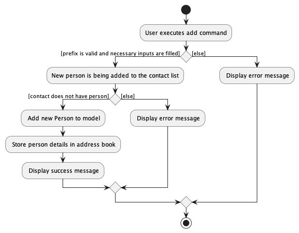
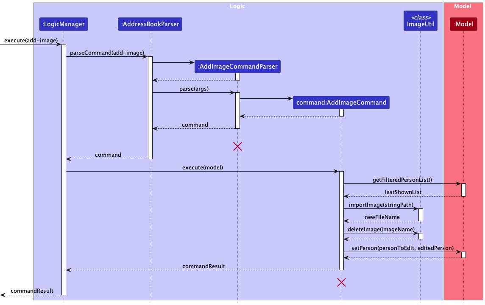
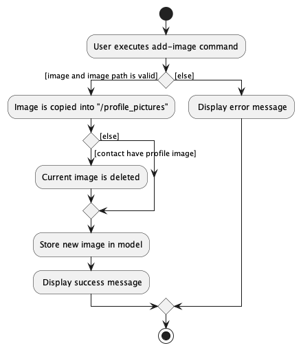
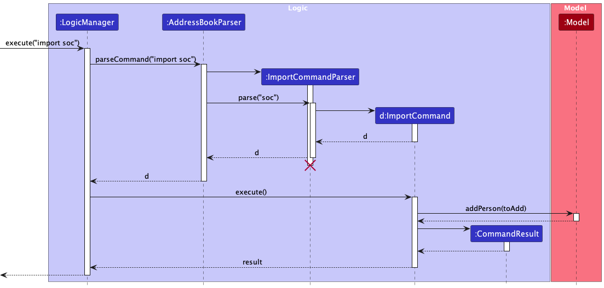
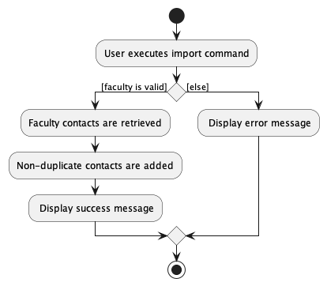
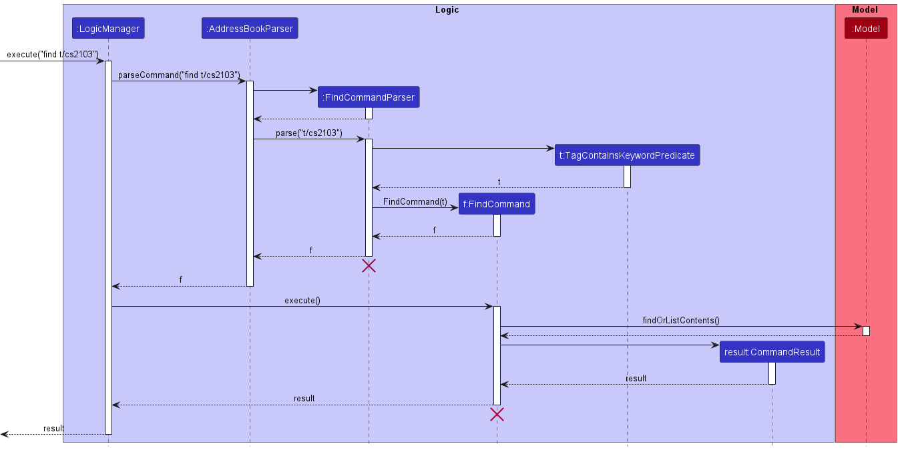

* [Acknowledgements](#acknowledgements)
* [Design](#design)
    * [Architecture](#architecture)
    * [UI component](#ui-component)
    * [Logic component](#logic-component)
    * [Model component](#model-component)
    * [Storage component](#storage-component)
    * [Common classes](#common-classes)
* [Implementation](#implementation)
    * [Add Feature](#add-feature)
    * [Delete Feature](#delete-feature)
    * [Add Image Feature](#add-image-feature)
    * [Delete Image Feature](#delete-image-feature)
    * [Import Contacts Feature](#import-contacts-feature)
    * [Find Feature](#find-feature)
    
* [Appendix: Requirements](#appendix-requirements)
    * [Product Scope](#product-scope)
    * [User Stories](#user-stories)
    * [Use Cases](#use-cases)
    * [Glossary](#glossary)
    * [Planned Enhancement](#planned-enhancement)

## Acknowledgements

* This project was based on the AddressBook3 application which can be found 
  [here](https://github.com/nus-cs2103-AY2223S2/tp)
  
---

## Design

### Architecture


The ***Architecture Diagram*** given above explains the high-level design of the App.

Given below is a quick overview of main components and how they interact with each other.

**Main components of the architecture**

**`Main`** has two classes called [`Main`](https://github.com/se-edu/addressbook-level3/tree/master/src/main/java/seedu/address/Main.java) and [`MainApp`](https://github.com/se-edu/addressbook-level3/tree/master/src/main/java/seedu/address/MainApp.java). It is responsible for,
* At app launch: Initializes the components in the correct sequence, and connects them up with each other.
* At shut down: Shuts down the components and invokes cleanup methods where necessary.

[**`Commons`**](#common-classes) represents a collection of classes used by multiple other components.

The rest of the App consists of four components.

* [**`UI`**](#ui-component): The UI of the App.
* [**`Logic`**](#logic-component): The command executor.
* [**`Model`**](#model-component): Holds the data of the App in memory.
* [**`Storage`**](#storage-component): Reads data from, and writes data to, the hard disk.

**How the architecture components interact with each other**

The *Sequence Diagram* below shows how the components interact with each other for the scenario where the user issues the command `delete 1`.


Each of the four main components (also shown in the diagram above),

* defines its *API* in an `interface` with the same name as the Component.
* implements its functionality using a concrete `{Component Name}Manager` class (which follows the corresponding API `interface` mentioned in the previous point.

For example, the `Logic` component defines its API in the `Logic.java` interface and implements its functionality using the `LogicManager.java` class which follows the `Logic` interface. Other components interact with a given component through its interface rather than the concrete class (reason: to prevent outside component's being coupled to the implementation of a component), as illustrated in the (partial) class diagram below.


The sections below give more details of each component.

### UI component

The **API** of this component is specified in [`Ui.java`](https://github.com/se-edu/addressbook-level3/tree/master/src/main/java/seedu/address/ui/Ui.java)

The UI consists of a `MainWindow` that is made up of parts e.g.`CommandBox`, `ResultDisplay`, `PersonListPanel`, `StatusBarFooter` etc. All these, including the `MainWindow`, inherit from the abstract `UiPart` class which captures the commonalities between classes that represent parts of the visible GUI.

The `UI` component uses the JavaFx UI framework. The layout of these UI parts are defined in matching `.fxml` files that are in the `src/main/resources/view` folder. For example, the layout of the [`MainWindow`](https://github.com/se-edu/addressbook-level3/tree/master/src/main/java/seedu/address/ui/MainWindow.java) is specified in [`MainWindow.fxml`](https://github.com/se-edu/addressbook-level3/tree/master/src/main/resources/view/MainWindow.fxml)

The `UI` component,

* executes user commands using the `Logic` component.
* listens for changes to `Model` data so that the UI can be updated with the modified data.
* keeps a reference to the `Logic` component, because the `UI` relies on the `Logic` to execute commands.
* depends on some classes in the `Model` component, as it displays `Person` object residing in the `Model`.

### Logic component

**API** : [`Logic.java`](https://github.com/se-edu/addressbook-level3/tree/master/src/main/java/seedu/address/logic/Logic.java)

Here's a (partial) class diagram of the `Logic` component:


How the `Logic` component works:
1. When `Logic` is called upon to execute a command, it uses the `AddressBookParser` class to parse the user command.
1. This results in a `Command` object (more precisely, an object of one of its subclasses e.g., `AddCommand`) which is executed by the `LogicManager`.
1. The command can communicate with the `Model` when it is executed (e.g. to add a person).
1. The result of the command execution is encapsulated as a `CommandResult` object which is returned back from `Logic`.

The Sequence Diagram below illustrates the interactions within the `Logic` component for the `execute("delete 1")` API call.


<div markdown="span" class="alert alert-info">:information_source: **Note:** The lifeline for `DeleteCommandParser` should end at the destroy marker (X) but due to a limitation of PlantUML, the lifeline reaches the end of diagram.
</div>

Here are the other classes in `Logic` (omitted from the class diagram above) that are used for parsing a user command:


How the parsing works:
* When called upon to parse a user command, the `AddressBookParser` class creates an `XYZCommandParser` (`XYZ` is a placeholder for the specific command name e.g., `AddCommandParser`) which uses the other classes shown above to parse the user command and create a `XYZCommand` object (e.g., `AddCommand`) which the `AddressBookParser` returns back as a `Command` object.
* All `XYZCommandParser` classes (e.g., `AddCommandParser`, `DeleteCommandParser`, ...) inherit from the `Parser` interface so that they can be treated similarly where possible e.g, during testing.

### Model component
**API** : [`Model.java`](https://github.com/se-edu/addressbook-level3/tree/master/src/main/java/seedu/address/model/Model.java)


The `Model` component,

* stores the address book data i.e., all `Person` objects (which are contained in a `UniquePersonList` object).
* stores the currently 'selected' `Person` objects (e.g., results of a search query) as a separate _filtered_ list which is exposed to outsiders as an unmodifiable `ObservableList<Person>` that can be 'observed' e.g. the UI can be bound to this list so that the UI automatically updates when the data in the list change.
* stores a `UserPref` object that represents the user’s preferences. This is exposed to the outside as a `ReadOnlyUserPref` objects.
* does not depend on any of the other three components (as the `Model` represents data entities of the domain, they should make sense on their own without depending on other components)

<div markdown="span" class="alert alert-info">:information_source: **Note:** An alternative (arguably, a more OOP) model is given below. It has a `Tag` list in the `AddressBook`, which `Person` references. This allows `AddressBook` to only require one `Tag` object per unique tag, instead of each `Person` needing their own `Tag` objects.<br>


</div>


### Storage component

**API** : [`Storage.java`](https://github.com/se-edu/addressbook-level3/tree/master/src/main/java/seedu/address/storage/Storage.java)


The `Storage` component,
* can save both address book data and user preference data in json format, and read them back into corresponding objects.
* inherits from both `AddressBookStorage` and `UserPrefStorage`, which means it can be treated as either one (if only the functionality of only one is needed).
* depends on some classes in the `Model` component (because the `Storage` component's job is to save/retrieve objects that belong to the `Model`)

### Common classes

Classes used by multiple components are in the `seedu.addressbook.commons` package.

[Back to top](#top)

---

## Implementation

### Add Feature

#### Add Implementation

The Add feature is facilitated by the classes `AddCommand`,
`AddCommandParser` and `ParserUtil`.
The `AddCommandParser` first parses through the user command to obtain
the necessary inputs through using `ParserUtil#parseIndex`. Following which an
instance of a `AddCommand` containing the details encapsulated in Person class is returned.
`AddCommand#execute` is then called, which sets the image of the contact
at the desired index to a default image, and deletes the existing person through
`DeleteCommand`.

Given below is an example usage scenario for how the add mechanism behaves.

Step 1: User starts up the application and sees their list of contacts. User must then enter
[name] [status] [phone] [email] [address] as they are required by the system if not it will cause
an invalid exception.

Step 2: The user can add optional fields, that is the tags. Each of the tags is colour-coded based on its type.

> **Note**: If the user inputs a contact that exists in the contact list, or if the user misses out a compulsory
> input, an error will be thrown.

Step 3: If the instruction was valid, `AddCommand#execute` is called to wrap the details into person and set the
person to the next available index.

Step 4: User can use edit index to select the chosen person card and `EditCommand#execute` is then called to
change the contents inside and update the program directory.

The following sequence diagram shows how the `add` operation works.


> **Note**: The lifeline of the `AddCommandParser` and `AddCommand`
> should end at the destroy marker (X) but due to the limitations of PlantUML, the
> lifeline reaches the end of the diagram.

The following activity diagram summarizes what happens when a user executes a
add command:



#### Design Considerations:

- **Alternative 1 (current choice):** Improve on tags by adding more colours to the
  program directory.
    - Pros:
        - Ensures the labels are organised neatly in different colour
    - Cons:
        - Extra complexity in requiring to map the additional tag operations

- **Alternative 2:** Make status field compulsory from program directory.
    - Pros:
        - Easier to implement and user can search based on year and course
    - Cons:
        - Application will not detect the input content from the users which could contain
          non-related strings.

[Back to top](#top)

### Delete Feature

#### Delete Implementation

{Todo: Add delete implementation}

#### Design Considerations

{Todo: Add design considerations for delete}

[Back to top](#top)

### Add Image Feature

#### Add Image Implementation

The add-image mechanism is facilitated by `AddImageCommand`, `AddImageCommandParser` and `ImageUtil` class.

- `AddImageCommand` extends `Command`
- `AddImageCommandParser` extends `Parser`

The `AddImageCommandParser` parses the user input into index of contact and path to an image.
It returns a `AddImageCommand` with the 2 information retrieved.
`AddImageCommand#execute` copies the image provided by the user via a path and replaces the current image with the new
one.
It also saves the file name of the new image to the `model`.

Given below is an example usage scenario and how the add-image mechanism behaves at each step.

Step 1. When user wants to add an image to a contact, they use the `add-image` command.

Step 2. The `LogicManager` receives the command text from the user input and gives it to `AddressBookParser`
. `AddressBookParser` calls `AddImageCommandParser` to parse the user input.

Step 3. The `AddImageCommandParser` retrieves the contact index as well as the image path and creates
a `AddImageCommand`

Step 4. `AddImageCommand#execute` is called. The method calls `ImageUtil#importImage` to copy the image into the "
profile_pictures/" directory.
Once that is successful, `AddImageCommand#execute` proceeds to call `ImageUtil#deleteImage` to remove the current image.
Finally `AddImageCommand#execute` updates the model provided in the arguments.

> **Note**: If the path given is invalid or if the file at the given path is not a png/jpeg image, the command will not
> be completed.

The following sequence diagram shows how the add-image operation works:<br>

> **Note**: The lifeline of the `AddImageCommandParser` and `AddImageCommand`
> should end at the destroy marker (X) but due to the limitations of PlantUML, the
> lifeline reaches the end of the diagram.

The following activity diagram summarizes what happens when a user executes add-image command: <br>


#### Design considerations:

- Alternative 1 (current choice): Copy the image into application-created directory
    - Pros:
        - A single location to store/check for images
        - Naming scheme determined by application
    - Cons:
        - Copying is a file I/O which have many caveats
- Alternative 2: Save the path provided by User
    - Pros:
        - Does not require any file I/O
        - Easy to save as only the Path as a string
    - Cons:
        - Path is easily invalidated (e.g. user moves/deletes/renames the image)

[Back to top](#top)

### Delete Image Feature

#### Delete Image Implementation

The delete-image feature is facilitated by the classes `DeleteImageCommand`,
`DeleteImageCommandParser`, `ImageUtil`, and `ParserUtil`.
The `DeleteImageCommandParser` first parses through the user command to obtain
the desired index through using `ParserUtil#parseIndex`. Following which an
instance of a `DeleteImageCommand` containing the desired index is returned.
`DeleteImageCommand#execute` is then called, which sets the image of the contact
at the desired index to a default image, and deletes the existing image through
`ImageUtil#deleteImage`.

Given below is an example usage scenario for how the delete-image mechanism behaves.

Step 1: User starts up the application and sees their list of contacts. Some of
which have already had an image added.

Step 2: The user decides that the image given to the contact at index 4 is not
suitable, and wants to delete it. The user inputs `delete-image 4`.
`DeleteImageCommandParser#parse` is then called to parse this input for the
desired index.

> **Note**: If the user inputs an index of a contact which currently does not have
> an image, or if the user inputs an invalid index, an error will be returned to
> the user

Step 3: If the instruction was valid, `Model#deleteImage` is called to set the
image of the contact to the default image.

Step 4: `ImageUtil#deleteImage` is then called to delete the existing image
from the program directory.

The following sequence diagram shows how the delete-image operation works.


> **Note**: The lifeline of the `DeleteImageCommandParser` and `DeleteImageCommand`
> should end at the destroy marker (X) but due to the limitations of PlantUML, the
> lifeline reaches the end of the diagram.

The following activity diagram summarizes what happens when a user executes a
delete-image command:


#### Design Considerations:

- **Alternative 1 (current choice):** Delete the existing image file from program
  directory.
    - Pros:
        - Ensures application does not consume excess storage
    - Cons:
        - Extra complexity in requiring file i/o operations

- **Alternative 2:** Disregard deleting the image file from program directory.
    - Pros:
        - Easier to implement
    - Cons:
        - Application will take up increasingly more unnecessary storage during
          its lifetime of usage

[Back to top](#top)

### Import Contacts Feature

#### Import Contacts Implementation

The import feature is facilitated by the classes `ImportCommand`, `ImportCommandParser`,
`SocContacts` and `ChsContacts`. The `ImportCommandParser` first parses through the user
command to obtain the desired faculty to be imported. An instance of
a `ImportCommand` containing the desired faculty from either `SocContacts` or
`ChsContacts` is then returned. `ImportCommand#execute` is then called,
which calls `Model#addPerson` to add the unique contacts into BookFace.

Given below is an example usage scenario for how the import mechanism behaves.

Step 1: User starts up the application and sees their list of contacts.

Step 2: User decides to import contacts from faculty SOC and input
`import soc`. `ImportCommandParser#parse` is then called to parse
this input for the desired faculty.

> **Note**: If the user inputs a faculty that does not exist,
> an error will be returned to the user

Step 3: If the faculty was valid, `ImportCommand#execute` is called
with the valid faculty that was parsed

Step 4: `Model#addPerson` is called for however
many non-duplicate contacts are to be added.

The following sequence diagram shows how the import command works.



The following activity diagram summarizes what happens when a user executes an
import command:



#### Design Considerations:

- **Alternative 1 (current choice):** ImportCommand#execute takes in a string to
  determine which faculty of in-built contacts to import
    - Pros:
        - User input is easily parsed (as it is just a string), faster to read and
          execute the command
    - Cons:
        - Possibly bad OOP design, ImportCommand#execute should take in a Faculty object

- **Alternative 2:** ImportCommand#execute takes in a Faculty object instead of a string
  to determine which faculty of in-built contacts to import
    - Pros:
        - Better OOP design then simply taking in a string
    - Cons:
        - Input will take longer to parse as the string input has to be parsed into
          a faculty object to be used as input to ImportCommand#execute

[Back to top](#top)
        
### Find Feature

#### Find Implementation

The Find feature allows users to filter out relevant contacts from their contact list.
This feature is facilitated by the `FindCommand` class and the `FindCommandParser` class,
as well as the various predicate classes listed below.

* `AddressContainsKeywordPredicate`
* `EmailContainsKeywordPredicate`
* `NameContainsKeywordPredicate`
* `PhoneContainsKeywordPredicate`
* `StatusContainsKeywordPrediate`
* `TagContainsKeywordPredicate`

When the user inputs a `find` command, the `FindCommandParser` parses through the
input to obtain the prefixes and keywords that the user has entered. For each
prefix-keyword pair, an instance of its associated predicate class is created
and all the instances are combined with `Predicate#and`. This final predicate
object is then passed to `Model#findOrListContents` to display the filted list to
the user.

An example usage scenario is provided below to illustrate the mechanism of the
`find` command.

Step 1: User starts up the application and sees a list of all their contacts.

Step 2: User inputs `find t/cs2103` to find the list of his contacts that takes
CS2103.

Step 3: `FindCommandParser` parses through the user input and creates an instance
of `TagContainsKeywordPredicate` containing the keyword "cs2103". An instance of
`FindCommand` with this predicate is then created and returned.

Step 4: `FindCommand#execute` is called, which calls `Model#findOrListContents`
to display the final filtered list to the user.

The sequence diagram below illustrates this process.



#### Design Considerations:

**Aspect: Combining the predicates from multiple prefixes**

- **Alternative 1 (current choice):** Using `Predicate#and`
- **Alternative 2:** Using `Predicate#or`

**Rationale:** Decision was made to use a logical `AND` instead of `OR` when
combining multiple predicates as we believe this was the more intuitive approach.
When a user is looking for a specific group of people on his contacts, they would
expect the application to return a list of contacts that matches **all** of his
given input requirements, instead of a list of contacts that contains one or more
of the keywords that was entered. Hence, the logical `AND` was decided to be more
appropriate, and `Predicate#and` was used.

[Back to top](#top)

---

## Appendix: Requirements

### Product Scope

**Target user profile**:

Students from the National University of Singapore (NUS) who need to keep track of their contacts from different
classes/ccas/clubs etc.

**Value proposition**:

NUS Students often take many classes and meet different people. This application helps them to organise their
contacts list for an easier way to set up proper communication channels. This makes it easier for students to form
connections with their peers during their time in University.

[Back to top](#top)

### User stories

1. As a student, I can find all relevant university contacts/POCs for various purposes
2. As a student, I can delete the image for a person on my contact list
3. As a forgetful student, I can see who a person on my contact list looks like
4. As a user, I can add a contact so that I can keep track of my contacts.
5. As a user, I can view all contacts so that I can have an accessible list of contacts.
6. As a user, I can delete a contact so that I can remove unneeded and/or incorrect contacts.
7. As a student, I can to find other students in my classes that have been added as a contact so that I can ask them for
   help

[Back to top](#top)

### Use cases

System: BookFace

```
Use case: UC1 - Add Contact

Actor: User

MSS:
1. User chooses to add a contact.
2. User enters contact's details.
3. New user's contact's details are added to BookFace.
Use case ends.

Extensions:

2a. BookFace detects incomplete/invalid details entered.
BookFace displays an example of valid details.
System repeats Step 1-2 until valid details are entered.
```

```
Use case: UC2 - Delete Contact

Actor: User

MSS:
1. User chooses to delete a contact.
2. User enters contact's index.
3. Contact is deleted from BookFace.
Use case ends.

Extensions:

2a. BookFace detects incomplete/invalid index entered.
BookFace displays an example of a valid index.
System repeats Step 1-2 until valid information is entered.
```

```
Use case: UC3 - Edit Contact

Actor: User

MSS:
1. User chooses to edit a contact.
2. User enters contact's new details.
3. Contact is edited in BookFace.
Use case ends.

Extensions:

2a. BookFace detects incomplete/invalid details entered.
BookFace displays an example of valid details.
System repeats Step 1-2 until valid details are entered.
```

```
Use case: UC4 - Find Contact

Actor: User

MSS:
1. User chooses to find a contact.
2. User enters contact's name.
3. BookFace displays the matching contacts.
   Use case ends.

Extensions:

2a. BookFace detects no name entered.
BookFace displays an example of a valid name.
System repeats Step 1-2 until a name is entered.
```

```
Use case: UC5 - List Contacts

Actor: User

MSS:
1. User chooses to view all contacts.
2. BookFace displays all the user's contacts.
   Use case ends.
```

```
Use case: UC6 - Get Help on Commands

Actor: User

MSS:
1. User chooses to view instructions on how to use BookFace.
2. BookFace displays a url to its User Guide.
   Use case ends.
```

```
Use case: UC7 - Add Image for a Contact
Actor: User
MSS:
1. User chooses to add an image for a contact.
2. User enters contact index and image file path.
3. Image is added for contact.
   Use case ends.

Extensions:

2a. BookFace detects invalid/incomplete filepath or index.
BookFace displays an example of a valid filepath and index.
System repeats Step 1-2 until valid information is entered.
```

```
Use case: UC8 - Delete Image for a Contact

Actor: User

MSS:
1. User chooses to delete an image for a contact.
2. User enters contact index.
3. Image is deleted for contact.
   Use case ends.

Extensions:

2a. BookFace detects incomplete/invalid index entered.
BookFace displays an example of a valid index.
System repeats Step 1-2 until valid information is entered.

2b. BookFace detects that the contact does not have an image added.
Use case ends.
```

```
Use case: UC9 - Import Contacts from a Faculty

Actor: User

MSS:
1. User chooses to import contacts for a faculty.
2. User enters faculty name.
3. New contacts' details are added to BookFace.
   Use case ends.

Extensions:

2a. BookFace detects incomplete/invalid details entered.
BookFace displays an example of valid details.
System repeats Step 1-2 until valid details are entered.
```

[Back to top](#top)

### Glossary

* NUS: The National University of Singapore
* Student: A user who belongs to a faculty in NUS and attends one or more classes with other students
* Tutor: A user who tutors students in one or more classes
* Faculty: A group of university departments concerned with a major division of knowledge
* Contact: A person of interest whose details have been recorded by the user

[Back to top](#top)

### Planned Enhancement

1. Currently, when attempting to retrieve image and is unsuccessful, the default image is displayed. 
    We plan to include and display an “error image” instead of default image to better express to user that the retrieval was unsuccessful. 
    With this error image, the `delete-image` command on this contact will change it to default image. 
    Currently, it only shows a success message as the image is already the default image.<br>
   (Ways that retrieval can be unsuccessful erroneous editing of Image field in `addressbook.json` or removing/changing images saved in `/profile_pictures` to invalid images or to a non-matching file name)
2. Currently, there is no restrictions regarding image size for the `add-image` command. We plan to impose a minimum image size restriction to prevent images that are too small.
3. Currently, the `import` command only allows importing contacts from 2 faculties.
4. Currently, imported contacts from the `import` command are not filled up with real data.

[Back to top](#top)

